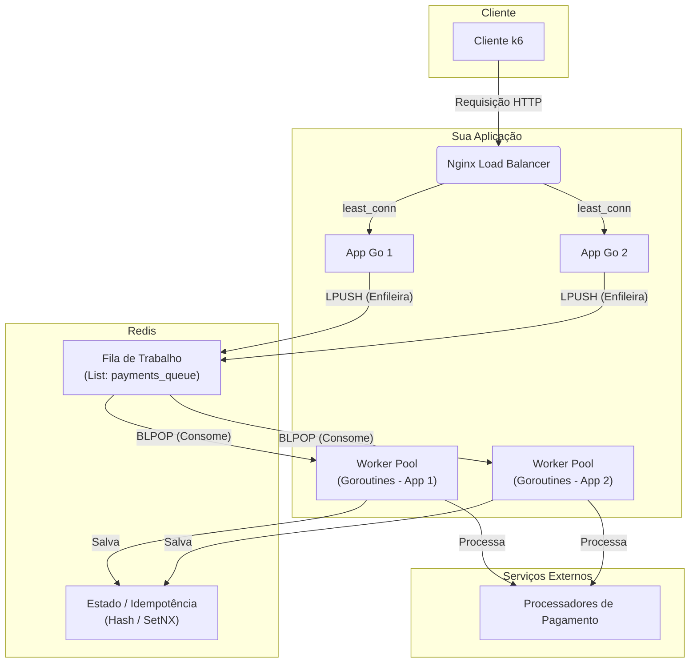

# Rinha de Backend 2025 - Implementação em Go

Esta é a minha submissão para a 3ª edição da Rinha de Backend, desenvolvida em Go. O objetivo foi construir uma API de pagamentos resiliente e de alta performance, explorando padrões de arquitetura de software e otimizações.

## ✨ Tecnologias Utilizadas

- **Linguagem:** Go 1.22+
- **Cache / Banco de Dados de Estado:** Redis 7
- **Fila de Mensagens:** Redis 7 (usando Listas)
- **Load Balancer:** Nginx
- **Ferramentas:** Docker & Docker Compose, k6

## 🏛️ Arquitetura Final

A arquitetura escolhida foi um sistema **assíncrono** com um padrão de **Worker Pool**, projetado para maximizar o throughput (vazão) e a resiliência, mantendo a latência da API extremamente baixa.



### Detalhes da Arquitetura

* **Gateway de Entrada (Nginx):** O Nginx atua como Reverse Proxy e Load Balancer utilizando a estratégia `least_conn` para distribuir a carga de forma inteligente entre as duas instâncias da aplicação. As conexões com as aplicações Go são mantidas ativas (`keep-alive`) para máxima performance.

* **API (Go):** A API exposta é extremamente leve. Sua única responsabilidade é receber a requisição `POST /payments`, validá-la minimamente e publicá-la em uma fila de trabalho no Redis. Isso garante tempos de resposta na casa dos milissegundos.

* **Fila de Trabalho (Redis Lists):** Em vez de Pub/Sub (broadcast), a comunicação é feita através de uma Lista no Redis, implementando um padrão de Fila de Trabalho (Work Queue). O comando `LPUSH` enfileira um trabalho, e o `BLPOP` garante que cada trabalho seja pego atomicamente por **apenas um** worker.

* **Workers Assíncronos:** Um pool de `goroutines` (workers) em cada instância da aplicação consome os trabalhos da fila em paralelo. É aqui que toda a lógica de negócio pesada acontece.

* **Resiliência:**
    * **Circuit Breaker:** Uma `goroutine` de *Health Check* dedicada e desacoplada monitora a saúde dos processadores de pagamento periodicamente, atualizando um estado compartilhado que os workers utilizam para decidir para qual processador enviar a requisição.
    * **Retentativas (Retries):** O gateway HTTP dos workers implementa uma política de retentativas com *backoff exponencial* para lidar com falhas temporárias dos serviços externos, evitando descartar pagamentos desnecessariamente.

* **Estado e Idempotência (Redis):**
    * O estado final é armazenado em Redis para máxima velocidade de escrita. A estratégia de **pré-agregação por segundo** é utilizada para permitir que a rota `GET /payments-summary` filtre por data de forma precisa e performática.
    * A **idempotência** é garantida através do comando `SetNX` do Redis, assegurando que uma mesma transação nunca seja processada duas vezes, mesmo que a mensagem seja entregue mais de uma vez.


## 🚀 Como Executar Localmente

1.  Clone este repositório.
2.  Certifique-se de ter o Docker e o Docker Compose instalados.
3.  Execute o ambiente:
    ```sh
    # O arquivo docker-compose.yml padrão já está configurado para o Redis.
    docker-compose up --build
    ```
4.  Em outro terminal, execute o teste de carga com o k6:
    ```sh
    k6 run rinha-test/rinha.js

## 📂 Estrutura do Projeto

O projeto segue uma estrutura baseada em princípios de Clean Architecture para separar as responsabilidades:

-   `cmd/server/main.go`: Ponto de entrada da aplicação, responsável pela inicialização, injeção de dependências e graceful shutdown.
-   `internal/config`: Carregamento de configurações.
-   `internal/domain`: Entidades, interfaces de repositório e lógica de negócio pura.
-   `internal/application`: Casos de uso que orquestram a lógica de negócio.
-   `internal/infra`: Implementações concretas de interfaces, como repositórios, gateways HTTP e o servidor web.


## 👤 Autor

**Rodrigo Militão**
- LinkedIn: [rodrigo-militao](https://linkedin.com/in/rodrigo-militao)