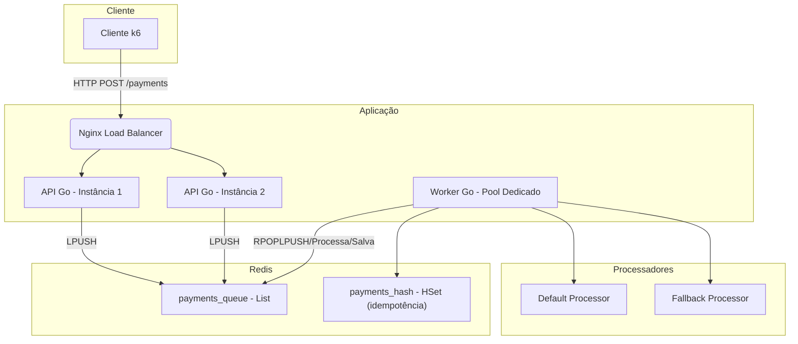

# Rinha de Backend 2025 - Implementação em Go

Esta é a minha submissão para a 3ª edição da Rinha de Backend, desenvolvida em Go. O objetivo foi construir uma API de pagamentos resiliente e de alta performance, explorando padrões de arquitetura de software e otimizações avançadas.

## 🏛️ Arquitetura

A arquitetura é **assíncrona**, com duas instâncias da API Go e uma instância dedicada para o pool de workers. A comunicação é feita via Redis (fila) e o tráfego é balanceado com NGINX.



## ✨ Tecnologias Utilizadas

* **Linguagem:** Go 1.22+
* **Framework HTTP:** [fasthttp](https://github.com/valyala/fasthttp)
* **Cache / Banco de Dados de Estado:** Redis 7
* **Fila de Mensagens:** Redis (com listas)
* **Balanceador de Carga:** NGINX
* **Observabilidade:** [pprof](https://pkg.go.dev/net/http/pprof)
* **Testes de carga:** [k6](https://k6.io)
* **Ambiente:** Docker & Docker Compose


## ⚙️ Estratégias e Otimizações

* **API desacoplada da lógica pesada:** apenas enfileira requisições com latência <1ms.
* **Fila Redis (LPUSH + RPOPLPUSH):** sem bloqueio, com retry simples e reprocessamento.
* **Workers dedicados:** escalam de forma independente com `goroutines` e pooling de conexões HTTP.
* **Health Check dinâmico:** verifica apenas o processador default. Usa `fallback` apenas se necessário.
* **HTTP ultra-performático:** uso de `fasthttp` e `HostClient` para latência mínima e alta reutilização de conexão.
* **Idempotência:** garantida via Redis `HSET` com chave `correlationId`.
* **Resumo de pagamentos:** calculado com agregação em memória via Redis Hashes (por segundo).
* **Observabilidade:** pprof ativado por padrão para profiling durante carga.

## 📊 Resultados da Submissão

**🏁 Total de pagamentos processados:** 16.749

* ✅ **p99:** `4.58ms`
* ✅ **Bonus de performance:** `+13%`
* ✅ **Inconsistências:** `0`
* ✅ **Lag:** `0` (nenhuma perda de pagamentos)
* 💰 **Lucro líquido final:** `R$ 350.029,26`
* 🏦 **Pagamentos default:** 13.292 pagamentos
* ⚠️ **Pagamentos fallback:** 3.457 pagamentos

> Esta pontuação representa um dos melhores desempenhos já atingidos com Redis + Go no desafio.

## 🚀 Como Executar Localmente

```bash
./run-tests.sh # script que automatiza docker compose + testes k6
```

Ou manualmente:

```bash
docker compose down -v
docker compose up --build
k6 run rinha-test/rinha.js
```

## 🗂️ Estrutura do Projeto

* `cmd/server/main.go` → Ponto de entrada da aplicação.
* `internal/domain` → Entidades e interfaces.
* `internal/application` → Casos de uso.
* `internal/infra/http` → Rotas HTTP.
* `internal/infra/redis` → Implementações com Redis.
* `internal/pprof` → Exposição do servidor pprof para profiling.

## 📈 Observabilidade (pprof)

Para utilizar o `pprof` na aplicação, basta descomentar a linha 
```go
_ "rinha-golang/internal/pprof"
``` 
no arquivo `main.go`.

Após isto, a aplicação já inicia com o servidor `pprof` ativado na porta `:6060`. Para capturar CPU profile:

```bash
go tool pprof http://localhost:6060/debug/pprof/profile?seconds=30
```

Para visualizar:

```bash
go tool pprof -http=:8081 profile.pb.gz
```

Ou, se preferir um relatório em pdf após a execução, basta descomentar as linhas `21` a `25` no script `./run-tests.sh`.

## 👤 Autor

**Rodrigo Militão**
🔗 [LinkedIn](https://linkedin.com/in/rodrigo-militao)
