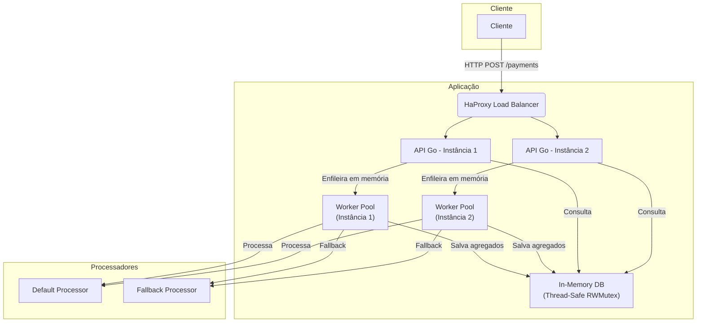

# Rinha de Backend 2025 - Implementação em Go

Esta é a minha submissão para a 3ª edição da Rinha de Backend, desenvolvida em Go.  
O objetivo foi construir uma API de pagamentos resiliente e de altíssima performance, explorando padrões de arquitetura assíncrona, uso de banco em memória customizado e técnicas avançadas de otimização.

## 🏛️ Arquitetura

A arquitetura é **assíncrona**, com duas instâncias da API Go e workers embutidos para processamento paralelo.  
O tráfego é balanceado com **HaProxy**, e os resultados são armazenados em um **banco em memória thread-safe** (sem Redis).


```mermaid
graph TD
    subgraph Cliente
        A[Cliente]
    end

    subgraph Aplicação
        B(HaProxy Load Balancer)
        C1[API Go - Instância 1]
        C2[API Go - Instância 2]
        D1["Worker Pool<br/>(Instância 1)"]
        D2["Worker Pool<br/>(Instância 2)"]
        F["In-Memory DB<br/>(Thread-Safe RWMutex)"]
    end

    subgraph Processadores
        G[Default Processor]
        H[Fallback Processor]
    end

    A -->|HTTP POST /payments| B
    B --> C1
    B --> C2
    C1 -->|Enfileira em memória| D1
    C2 -->|Enfileira em memória| D2

    D1 -->|Processa| G
    D2 -->|Processa| G
    D1 -->|Fallback| H
    D2 -->|Fallback| H

    D1 -->|Salva agregados| F
    D2 -->|Salva agregados| F

    C1 -->|Consulta| F
    C2 -->|Consulta| F
```

## ✨ Tecnologias Utilizadas

* **Linguagem:** Go 1.22+
* **Framework HTTP:** [fasthttp](https://github.com/valyala/fasthttp)
* **Banco de Dados:** In-Memory DB customizado (sync.RWMutex + slice)
* **Fila de Mensagens:** Channels (chan []byte + chan *PaymentRequest)
* **Balanceador de Carga:** HaProxy
* **Observabilidade:** pprof
* **Testes de carga:** k6
* **Ambiente:** Docker & Docker Compose


## ⚙️ Estratégias e Otimizações

* **API desacoplada da lógica pesada:** apenas enfileira requisições com latência <1ms.
* **Fila em memória:** baseada em channels para eliminar hops de rede (sem Redis).
* **Workers otimizados:** pool de goroutines processando pagamentos em paralelo com retry simples.
* **Banco em memória customizado:** usa slices + RWMutex para leituras concorrentes seguras.
* **Agregação em tempo real:** queries de resumo (/payments-summary) calculadas diretamente sobre os dados em memória.
* **Pooling agressivo:** uso de sync.Pool para objetos (PaymentRequest, buffers JSON).
* **HTTP ultra-performático:** fasthttp.HostClient com reuso de conexões e latência mínima.
* **Observabilidade:** pprof habilitado para profiling e tunning sob carga.

## 📊 Resultados da Submissão

**🏁 Total de pagamentos processados:** 16.625

* ✅ **p99:** `1.68ms`
* ✅ **Bonus de performance:** `+19%`
* ✅ **Inconsistências:** `0`
* ⚠️ **Lag:** `128` (pagamentos ainda na fila no fim do teste)
* 💰 **Lucro líquido final:** `R$ 374.011,79`
* 🏦 **Pagamentos default:** 16.625 pagamentos
* 🚫 **Pagamentos fallback:** 0


> Uma das melhores execuções até agora usando apenas Go + in-memory DB, sem Redis.
A eliminação de hops de rede trouxe p99 extremamente baixo, com performance consistente.

## 🚀 Como Executar Localmente

```bash
./run-tests.sh # script que automatiza docker compose + testes k6
```

Ou manualmente:

```bash
docker compose down -v
docker compose up --build
k6 run rinha-test/rinha.js
```

## 🗂️ Estrutura do Projeto

* `cmd/server/main.go` → Ponto de entrada da aplicação.
* `internal/domain` → Entidades e interfaces.
* `internal/application` → Casos de uso.
* `internal/infra/database` → Banco em memória (MemDB).
* `internal/infra/worker` → Fila e workers assíncronos.
* `internal/infra/gateway` → Comunicação com processadores de pagamento.
* `internal/pprof` → Exposição do servidor pprof para profiling.

## 📈 Observabilidade (pprof)

Para utilizar o `pprof` na aplicação, basta descomentar a linha 
```go
_ "rinha-golang/internal/pprof"
``` 
no arquivo `main.go`.

Após isto, a aplicação já inicia com o servidor `pprof` ativado na porta `:6060`. Para capturar CPU profile:

```bash
go tool pprof http://localhost:6060/debug/pprof/profile?seconds=30
```

Para visualizar:

```bash
go tool pprof -http=:8081 profile.pb.gz
```

Ou, se preferir um relatório em pdf após a execução, basta utilizar o comando `make` no terminal.

## 👤 Autor

**Rodrigo Militão**
🔗 [LinkedIn](https://linkedin.com/in/rodrigo-militao)
